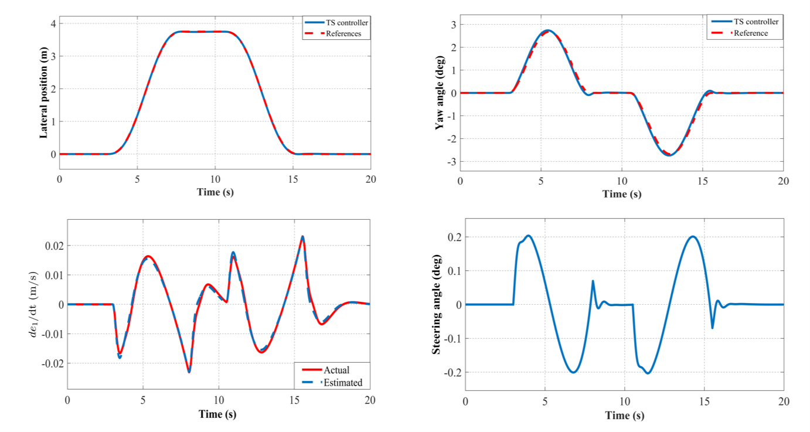

# car_ts_fuzzy_compressed

## Introduction

This repository contains all the essential files required for the implementation of the Takagi-Sugeno Fuzzy controller for reference tracking of a tower crane system, as presented in our paper ["Observer-Based Lateral Motion Control of an Autonomous Vehicle Via Takagi-Sugeno Fuzzy System"](https://link.springer.com/chapter/10.1007/978-3-031-19694-2_36). The implementation of the controller is done using MATLAB/Simulink. 

## Results

